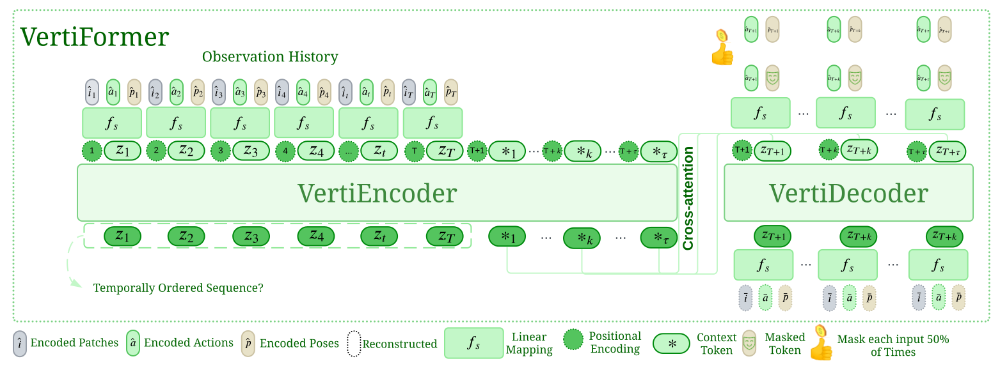

# [<span style="color:green">VertiFormer</span>: A Data-Efficient Multi-Task Transformer for Off-Road Robot Mobility](https://arxiv.org/abs/2502.00543)
[](https://opensource.org/licenses/MIT)
[](https://robotixx.cs.gmu.edu/)

[Mohammad Nazeri](https://mhnazeri.github.io/), [Anuj Pokhrel](https://anujpokhrel.github.io/), Alex Card, [Aniket Datar](https://datar-aniket.github.io), Garrett Warnell and [Xuesu Xiao](https://cs.gmu.edu/~xiao/)
<hr style="border: 2px solid gray;"></hr>

<span style="color:green">VertiFormer</span>, a non-autoregressive multi-task Transformer that efficiently predict robot dynamics and terrain in challenging off-road environments with limited data.
<p align="center">
  
</p>

Three ingredients of <span style="color:green">VertiFormer</span> to achieve this:
* Unified latent space representation
* Multiple context tokens
* Learnable modality masking

## Installation
Main libraries:
* [PyTorch](https://www.pytorch.org/): as the main ML framework
* [Comet.ml](https://www.comet.ml): tracking code, logging experiments
* [OmegaConf](https://omegaconf.readthedocs.io/en/latest/): for managing configuration files

First create a virtual env for the project.
```bash
python3 -m venv .venv
source .venv/bin/activate
```

Then install the latest version of PyTorch from the [official site](htpps://www.pytorch.org/). Finally, run the following:
```bash
pip install -r requirements
pip install -e .
```

## Training
Model config files are inside [config](vertiformer/conf/) directory. To run each model:

* VertiFormer: `./run.sh train_former`
* VertiDecoder: `./run.sh train_decoder`
* VertiEncoder: `./run.sh train_encoder`
    * DT heads: `./run.sh train_dt`

## Repository Structure
```commandline
 .
├──  README.md
├── 󰌠 requirements.txt
├──  run.sh                                # entry point
├──  setup.py
├──  deployment                            # robot deployment code
└──  vertiformer
    ├──  __init__.py
    ├──  conf                              # configurations
    │   └──  *.yaml
    ├──  model                             # models definition
    │   └──  *.py
    ├──  train_dt.py                       # train engine
    ├──  train_vertidecoder.py
    ├──  train_vertiencoder.py
    ├──  train_vertiformer.py
    └──  utils                             # utility functions
        └──  *.py
```

## Acknowledgement
For IKD implementation, please refer to [this](https://github.com/acard5meg/VERTIFORMER_ikd) repository.

## Citation
If you find the code helpful, please cite these works:
```
@article{vertiformer,
  title={VertiFormer: A Data-Efficient Multi-Task Transformer for Off-Road Robot Mobility},
  author={Nazeri, Mohammad and Pokhrel, Anuj and Card, Alexandyr and Datar, Aniket and Warnell, Garrett and Xiao, Xuesu},
  journal={arXiv preprint arXiv:2502.00543},
  year={2025}
}
```
```
@article{vertiencoder,
  title={Vertiencoder: Self-supervised kinodynamic representation learning on vertically challenging terrain},
  author={Nazeri, Mohammad and Datar, Aniket and Pokhrel, Anuj and Pan, Chenhui and Warnell, Garrett and Xiao, Xuesu},
  journal={arXiv preprint arXiv:2409.11570},
  year={2024}
}
```